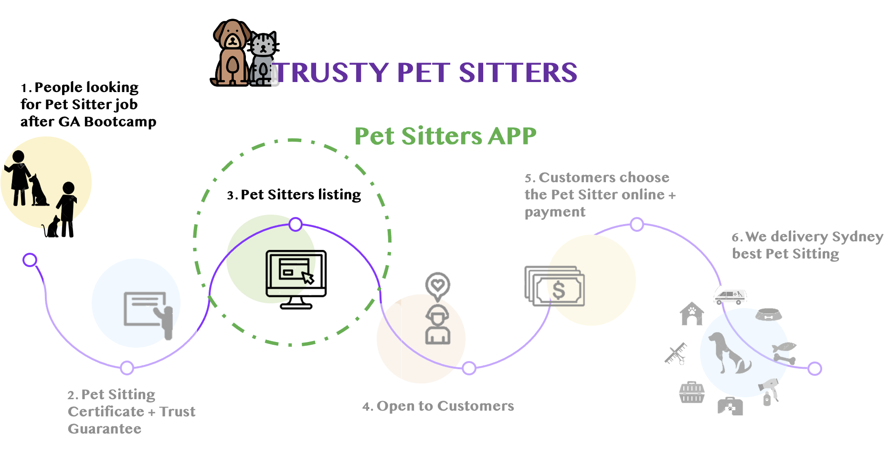

# React Pet Sitting App

A trustfull listing website with trained Pet Sitters around Sydney

This Single Page Application helps the company to keep a registration of their employees with a card listing fetched from the Express back-end API displaying information as their Certificates and Experiences and Personal contact. 


## 🏗️ Built with

- Node.JS
- React
- Express
- MongoDB


## 📋 Planning

- Researched other listing websites and Pet Sitting services

## 🦮 Try it out

- [On Heroku](https://petsitter-api.herokuapp.com/)

## 🧬 Or clone the repo

Clone the repo down by copying and pasting the below in your chosen directory then download it's dependencies

```
# Cloning
git clone https://github.com/larafsantoss/petsitter-api

# For Backend
npm install
npm run dev

# For Frontend
npm install
npm start
```

## 📊 Tests

- Backend
- FIRST npm run dev 
- THEN npm run test


## 🔮 Future updates

- Open listing to customers
- Add a page for booking - with filters
- Add Payment method via app

## MVP



---


